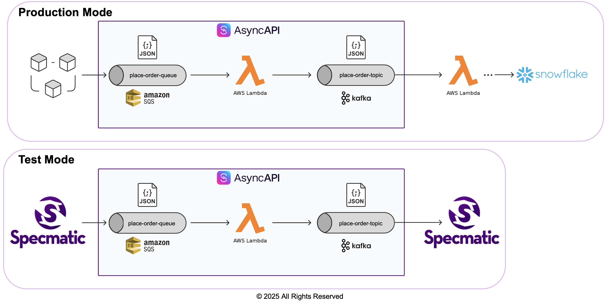

# Kafka to SQS Bridge

A Kotlin application that consumes order messages from Apache Kafka and publishes transformed messages to AWS SQS, with robust retry and Dead Letter Queue (DLQ) handling for failed messages.

## Overview

This service bridges Kafka and SQS by:
- Polling messages from a Kafka topic
- Transforming order messages based on type (Standard → WIP, Priority → DELIVERED, Bulk → COMPLETED)
- Publishing to SQS queue
- Automatically retrying failed messages with exponential backoff
- Sending permanently failed messages to DLQ for investigation

### Architecture



**Message Flow:**
1. Standard Order → WIP status (with itemsCount, processingStartedAt)
2. Priority Order → DELIVERED status (with itemsCount, deliveredAt, deliveryLocation)
3. Bulk Order → COMPLETED status (with total itemsCount, completedAt, customerConfirmation)
4. Failed messages → Retry topic (up to 3 attempts with exponential backoff)
5. Permanently failed messages → DLQ topic

### Retry & DLQ Flow

**Success Path**: Kafka → Transform → SQS Queue

**Failure Path**: 
```
Kafka → Transform (fails) → Retry Topic 
  → Retry Consumer (attempt 1, wait 1s) → Transform (fails) → Retry Topic
  → Retry Consumer (attempt 2, wait 2s) → Transform (fails) → Retry Topic
  → Retry Consumer (attempt 3, wait 4s) → Transform (fails) → DLQ Topic
```

**Key Points:**
- Retry Consumer processes messages directly from the Retry Topic
- On each retry attempt, it tries to transform and send to the SQS Queue
- If transformation still fails, the message goes back to the Retry Topic with incremented retry count
- After max retries (3), the message is sent to the DLQ Topic
- No circular loop between Kafka and SQS - retries happen entirely within Kafka

## Prerequisites

- Docker and Docker Compose
- Java 17+
- Gradle (wrapper included)
- AWS CLI (optional, for manual testing)
 
## Contract Testing with Specmatic Programmatically using TestContainers

### 1. Run the Contract Test

```bash
./gradlew clean test
```

This approach uses JUnit tests with TestContainers to programmatically start infrastructure, run the application, and execute Specmatic tests.

### 2. View Test Reports

After running tests, reports are saved in:
```
build/reports/specmatic/async/test/
├── html/index.html        # HTML report
└── ctrf/ctrf-report.json  # CTRF JSON report
```

## Contract Testing with Specmatic using Script

### Run the Tests

## Simply execute the provided script:

```bash
./run-contract-tests.sh
```

## Manual Cleanup (if needed)

If the script is interrupted and containers are still running:

```bash
docker-compose -f docker-compose-test.yml --profile test down -v
```

### CI/CD Integration

The script returns appropriate exit codes:
- `0` - All tests passed
- `1` - Tests failed or error occurred

Example CI/CD usage:

Add this in your `.github/workflows/test.yml`
```yaml
- name: Run Contract Tests
  run: ./run-contract-tests.sh
```

### View Test Reports

After running tests, reports are saved in:
```
build/reports/specmatic/
├── html/index.html        # HTML report
└── ctrf/ctrf-report.json  # CTRF JSON report
```

## Contract Testing with Specmatic Manually

### 1. Start Infrastructure

```bash
./start-infrastructure.sh
```

### 2. Run the application

```bash
./gradlew run
```

### 3. Run contract tests using Specmatic

```bash
docker run --rm --network host -v "$PWD/specmatic.yaml:/usr/src/app/specmatic.yaml" -v "$PWD/spec:/usr/src/app/spec" -v "$PWD/build/reports/specmatic:/usr/src/app/build/reports/specmatic" specmatic/specmatic-async test
```

## Running the Application

### 1. Start Infrastructure

```bash
./start-infrastructure.sh
```

This starts LocalStack (SQS), Kafka, Zookeeper, and Kafka UI.

### 2. Run the application

```bash
./gradlew run
```

You should see:
```
============================================================
SQS to Kafka Bridge Application
============================================================
Starting SQS to Kafka bridge...
```

## Testing the Application Manually

### Send Test Messages

Use the provided script to send all order types:

```bash
./send-test-message.sh
```

This sends:
- Standard order → transforms to WIP
- Priority order → transforms to DELIVERED
- Bulk order → transforms to COMPLETED
- Invalid message → rejected (not forwarded)

### View Results in Kafka UI

1. Open http://localhost:8080
2. Navigate to **Topics** → **place-order-topic** → **Messages**
3. You'll see the transformed messages

**Expected Kafka messages:**

Standard Order (WIP)
```json
{"orderId": "ORD-90001", "itemsCount": 2, "status": "WIP", "processingStartedAt": "..."}
```
Priority Order (DELIVERED)
```json
{"orderId": "ORD-PRIORITY-90002", "itemsCount": 2, "status": "DELIVERED", "deliveredAt": "...", "deliveryLocation": "..."}
```
Bulk Order (COMPLETED)
```json
{"batchId": "BATCH-90003", "itemsCount": 3, "status": "COMPLETED", "completedAt": "...", "customerConfirmation": true}
```

**Application logs** will show:
```
Detected STANDARD order message
Processing STANDARD order: ORD-90001 with 2 items
Message sent to Kafka - Topic: place-order-topic, Partition: 0, Offset: 0
```

### Stop Everything

```bash
docker-compose down
```

## Testing Retry and DLQ Flow

### Send Test Messages for Retry/DLQ

Use the provided script to test retry and DLQ scenarios:

```bash
./test-retry-dlq.sh
```

This sends:
- 1 successful message (normal flow)
- 1 retry scenario message (will be retried)
- 1 DLQ scenario message (will go to DLQ after max retries)

### Monitor Kafka Topics

**Main Topic** (successful messages):
```bash
docker exec -it $(docker ps -qf 'name=kafka') \
  kafka-console-consumer --bootstrap-server localhost:9093 \
  --topic place-order-topic --from-beginning
```

**Retry Topic** (messages being retried):
```bash
docker exec -it $(docker ps -qf 'name=kafka') \
  kafka-console-consumer --bootstrap-server localhost:9093 \
  --topic place-order-retry-topic --from-beginning
```

**DLQ Topic** (permanently failed messages):
```bash
docker exec -it $(docker ps -qf 'name=kafka') \
  kafka-console-consumer --bootstrap-server localhost:9093 \
  --topic place-order-dlq-topic --from-beginning
```

### Application Logs

Watch the logs to see the retry flow in action:
- Initial failure and send to retry topic
- Retry attempts with exponential backoff (1s, 2s, 4s, etc.)
- Success after retry OR final failure and send to DLQ
