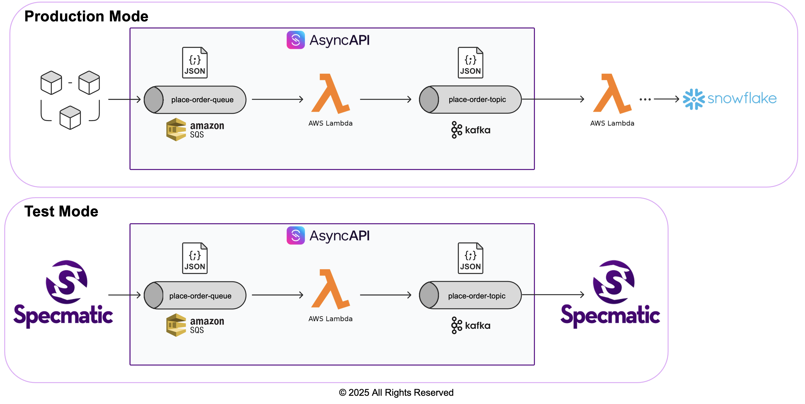

# Kafka to SQS Bridge

This project consumes order events from Kafka, transforms them by order type, writes the transformed payloads to SQS, and routes transformation failures through Kafka retry and DLQ topics.

## Flow



Success path:

```text
Kafka place-order-topic -> transform -> SQS place-order-queue
```

Failure path:

```text
Kafka place-order-topic -> transform fails -> Kafka place-order-retry-topic
  -> retry consumer -> transform succeeds -> SQS place-order-queue
  -> retry consumer -> max retries reached -> Kafka place-order-dlq-topic
```

Transformations:

- `STANDARD` -> `WIP`
- `PRIORITY` -> `DELIVERED`
- `BULK` -> `COMPLETED`

## Prerequisites

- Docker and Docker Compose
- Java 17+
- AWS CLI and `jq` for manual queue inspection

## Run ContractTest

The contract test starts LocalStack and Kafka, launches the Kotlin bridge and retry consumer, then runs Specmatic against the AsyncAPI contract.

```bash
./gradlew test --tests ContractTest
```

Reports are written to `build/reports/specmatic/`.

If you prefer the Docker-based wrapper that uses the single profile-based Compose file:

```bash
./run-contract-tests.sh
```

This wrapper is equivalent to:

```bash
docker compose --profile test up --build --abort-on-container-exit --exit-code-from contract-test contract-test
```

If your Specmatic license file is not at `../license.txt`, set `SPECMATIC_LICENSE_FILE` before running the Docker-based contract tests.

## Run Locally

Start infrastructure:

```bash
./start-infrastructure.sh
```

This starts the default Compose services from [docker-compose.yml](/Users/yogeshanandanikam/project/sample-projects/specmatic-sqs-kafka-sample/docker-compose.yml): `localstack`, `kafka`, `kafka-init`, and `kafka-ui`.

Run the application:

```bash
./gradlew run
```

Send sample Kafka messages:

```bash
./send-test-message.sh
```

Read transformed messages from SQS:

```bash
./consume-sqs-messages.sh
```

Send retry and DLQ scenarios:

```bash
./test-retry-dlq.sh
```

Inspect Kafka retry and DLQ topics:

```bash
docker compose exec kafka kafka-console-consumer --bootstrap-server localhost:9092 --topic place-order-retry-topic --from-beginning
docker compose exec kafka kafka-console-consumer --bootstrap-server localhost:9092 --topic place-order-dlq-topic --from-beginning
```

Stop the local stack:

```bash
docker compose down
```
